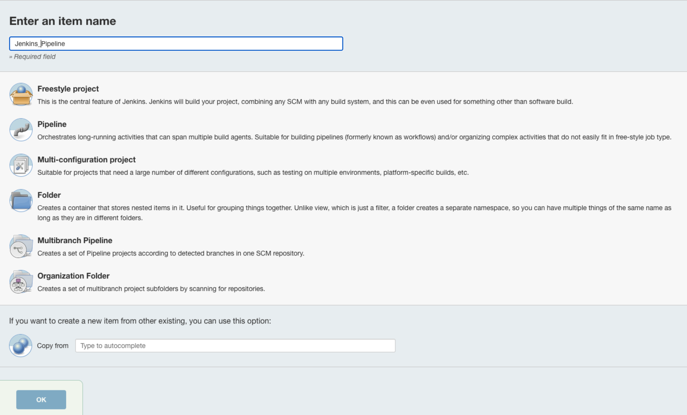
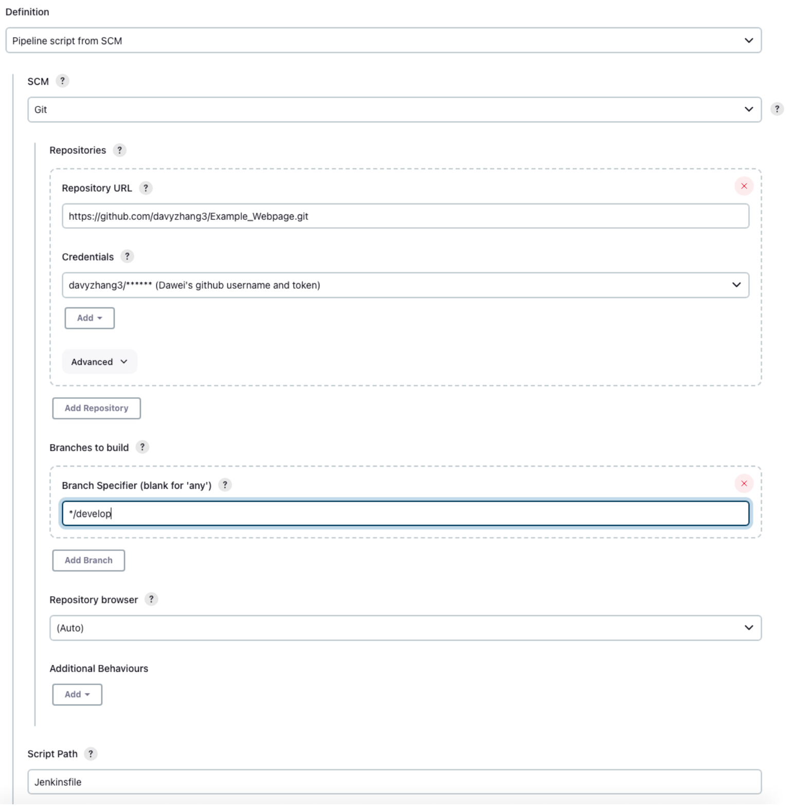

# CI/CD WITH JENKINS

This project contains terraform scripts which will provision a vpc, igw, a public subnet and 2 ec2 instances: one for running the jenkins and one for jenkins to deploy an app as a result of its build.
We install jenkins to the first ec2, make some configurations and run a pipeline which builds a docker image. This pipeline connects to the second ec2 via ssh and pulls the docker image and runs it to be displayed on the public address. The goal is to successfully deploy the app.

## Architecture


## Prerequisites

Before proceeding, ensure you have the following prerequisites installed:

- [Terraform](https://developer.hashicorp.com/terraform/install) (version 0.15.0)
- [Docker hub account](https://hub.docker.com/)

## How to run

To run the project:

- Export your environment variables or create them in a .tfvars file: `AWS_REGION`, `AWS_PROFILE`, `KEY_PAIR_NAME`.
- Execute the following commands:

```sh
$ terraform plan
$ terraform apply --auto-approve
```

- Go to your AWS account and find the EC2 named `jenkins-ec2`
- Follow the public ip of this EC2 on your browser on port 8080: `http://<you-ec2-public-ipv4>:8080`
- See a page like this:
  
- Connect to or ssh into your `jenkins-ec2` instance and run the following command `docker exec -it <yourcontainer ID> cat /var/jenkins_home/secrets/initialAdminPassword`
- Copy and paste the value to the Unlock Jenkins page into the Administrator password
- Create your jenkins user and password
  
- Leave the Instance Configuration as is and click on Save and Finish
  
- On the Jenkins dashboard go to Manage Jenkins on the left pane and click Tools
  
- Scroll to the bottom of the page
  
- Click on Add Maven and enter name and click save
  
- Go back to your `jenkins-ec2` terminal and get the jenkins container id with `docker ps`
- Go inside the container by `docker exec -u root -it <jenkins-container-id> /bin/bash`
- Install nodejs and npm and exit

```sh
$ apt update
$ apt install -y nodejs
$ apt install -y npm
$ exit
```

- Stop your jenkins container with `docker stop <jenkins-container-id>`
- Start up a new jenkins container with the volume of the previous container

```sh
$ docker run -p 8080:8080 -p 50000:50000 -d -v jenkins_home://var/jenkins_home  -v /var/run/docker.sock:/var/run/docker.sock jenkins/jenkins:lts
```

- Go inside the new container as root user and install docker so that we can execute docker commands inside it

```sh
$ docker exec -it -u root <your-new-jenkins-container-id> /bin/bash
$ apt update -y
$ apt-get install -y docker.io
$ chmod 666 /var/run/docker.sock
$ exit
```

- Go inside the container again as jenkins user and get the running container id

```sh
$ docker exec -it <jenkins-container-id> /bin/bash
$ docker ps
```

- Install python, pip and venv which is required for the Jenkinsfile

```sh
$ docker exec -it -u root <container-id-from-previous-step> /bin/bash
$ apt install -y python3 python3-pip python3-venv
```

- Go to the browser with the jenkins dashboard at `http://<you-jenkins-ec2-public-ipv4>:8080`
- Go to Manage Jenkins and to Credentials next to global click the arrow to add a new credential
- Create a username and password credential with your Docker hub credentials and `docker_cred` as the ID
  
- Create a secret text type of credential with the ID `deployment_ip` and inside the text put the private ipv4 address of the `deployment-ec2` on your aws account.
- Lastly create an ssh key type of credential with the Id `ssh_key` and paste the contents of your ssh key that you used while running the terraform file to the key part.
- Go back to the Jenkins dashboard and click on new item, select the pipeline option and name it whatever you like and click OK
  
- Scroll down to the pipeline section and choose pipeline script from SCM
  
- In SCM part select Git, and in Repository Url put `https://github.com/LaraTunc/wcd-6-cicd-w-jenkins`
- Leave the Credentials part empty but specify the main branch in the Branches to build part and save.
  
- Now on the left pane click Build which will trigger the pipeline and deploy the dockerized app in this repository on the `deployment-ec2`.
- Connect to the `deployment-ec2` public ip on http to see the result.

## How to destroy

- To destroy the resources afterward:

```sh
$ terraform destroy --auto-approve
```

## URL to public GitHub repo

https://github.com/LaraTunc/wcd-6-cicd-w-jenkins
